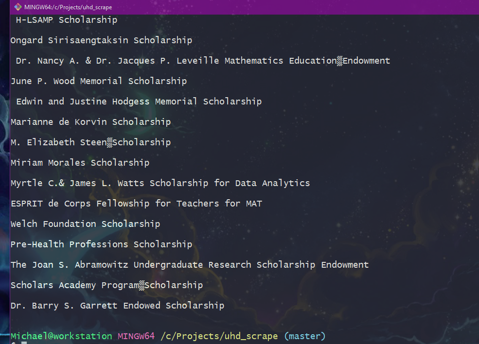

# Python Webscraper for UHD CST Scholarships 

### This script scrapes the CST scholarship webpage and prints the name of scholarships found to terminal.

### Required Packages: 
    - requests 
    - BeautifulSoup

### Screenshot:

